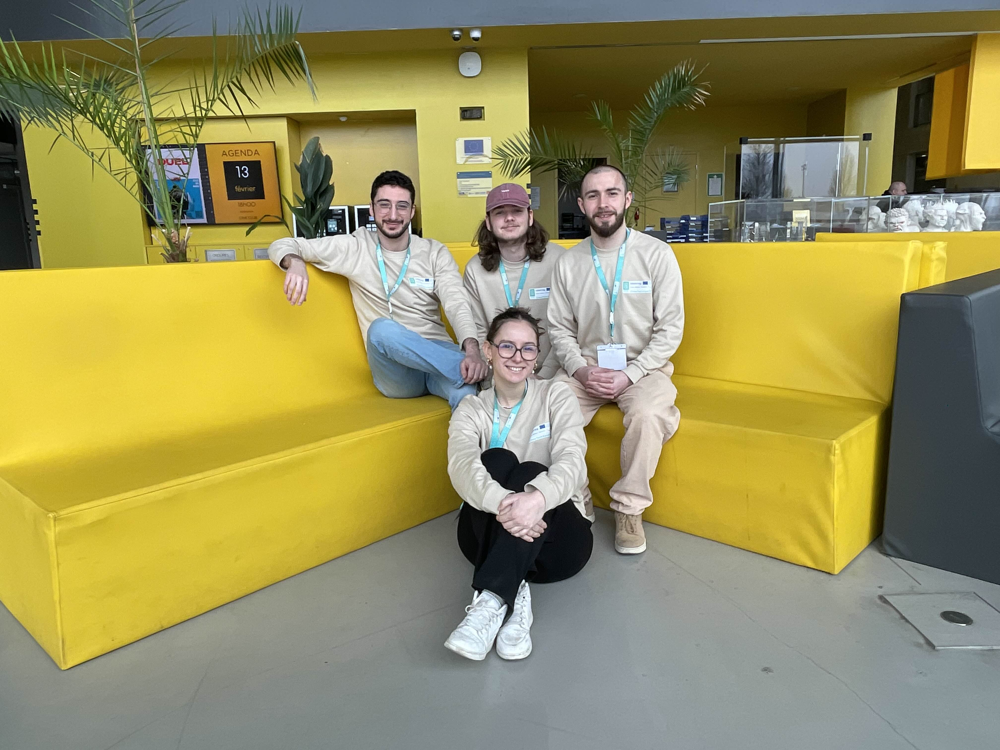

# CTX-Hackathon-1-LysQuest

_Find New Adventures_

## Pitch of the project

Bruges faces excessive tourist congestion, straining infrastructure and diminishing visitor experiences. Meanwhile, the nearby Lys region remains an underutilized destination with rich cultural and natural attractions. Traditional tourism methods fail to distribute visitors evenly, and local businesses miss opportunities to engage with travelers. Our innovative AI-powered mobile app leverages gamification and slow tourism to redistribute tourist flow from Bruges to the Lys region. Visitors engage with interactive interest points, completing challenges to earn rewards redeemable at local businesses. The app personalizes experiences using AI, offering immersive storytelling and real-time recommendations. Our project can lead to redistribute tourism by easing overcrowding in Bruges while promoting hidden gems in the Lys region. Through an engaging, interactive experience, visitors connect more deeply with local culture, enhancing their overall journey. By integrating sponsorships, we drive economic benefits to local businesses, supporting shops and artisans. Additionally, our focus on slow tourism encourages sustainable travel, reducing environmental impact and fostering a more balanced regional tourism model, etc. By blending AI-driven personalization with gamification, we create a win-win solution for tourists, local businesses, and sustainable regional tourism development.

For more information, please consult this [presentation slides](Lysquest.pdf)

## Ideas

The brainstorm and structured project ideas can be found in this [miro app](https://miro.com/welcomeonboard/ZzhGMkNFZlNpTDg5L05yQmtxanVtQUNqMVozeU1SZDhFa0x0ZGVTRys5QXJFSXdwdnhsYjlvak1tSGo1TjNiaGpmZFhuV2pJVWRCU0dod0ltbS9vd2tYUW1kWlpsL1RrMlZ4WmZZRVlYdGd1ekZGaDdPWGlyd1NQL3pkS0o5eVFBd044SHFHaVlWYWk0d3NxeHNmeG9BPT0hdjE=?share_link_id=681668785739).

## Team

- COLDEBELLA Brandon, Technocité
- DEVEZE Merynn, Rubika
- PARMENTIER Rico, Howest
- MAIORCA Antoine, UMONS

## Requirements

Style transfer source code comes from [https://github.com/diyiiyiii/StyTR-2](https://github.com/diyiiyiii/StyTR-2).

## Context

This project was developed during CrossTechXperience Interreg project ([http://www.crosstechxperience.eu](http://www.crosstechxperience.eu)) Hackathon #1.
This hackathon took place at Rubika ([https://rubika-edu.com/](https://rubika-edu.com/)) the 15th and 16th of February 2025.

